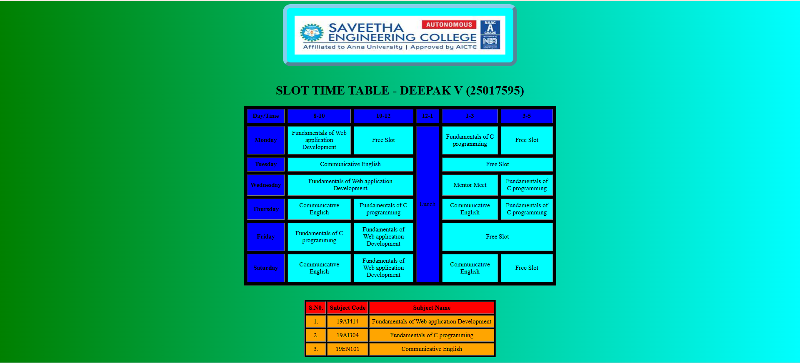

# Ex03 Time Table
# Date:28-09-25
# AIM
To write a html webpage page to display your slot timetable.

# ALGORITHM
## STEP 1
Create a Django-admin Interface.

## STEP 2
Create a static folder and inert HTML code.

## STEP 3
Create a simple table using `<table>` tag in html.

## STEP 4
Add header row using `<th>` tag.

## STEP 5
Add your timetable using `<td>` tag.

## STEP 6
Execute the program using runserver command.

# PROGRAM
```

<!DOCTYPE html>
<html lang="en">
<head>
    <meta charset="UTF-8">
    <meta name="viewport" content="width=device-width, initial-scale=1.0">
    <title>Slot Timetable</title>
    <!DOCTYPE html>
<html lang="en">
<head>
    <meta charset="UTF-8">
    <meta name="viewport" content="width=device-width, initial-scale=1.0">
    <title>Slot Timetable</title>
    <style>
        img{
            border:10px solid skyblue;
            border-radius:20px;
            padding:20px;
            border-style:outset;           
            background-color: cyan;
        }
        body{
            background-image: linear-gradient(90deg,green,cyan);
        }
    </style>
</head>
<body>
    <center>
        
    </center>
    <br>
    <table align="center" width="800" cellspacing="8"cellpadding="8"border="2"bgcolor="black">
    <caption><b><h1>SLOT TIME TABLE - DEEPAK V (25017595)</h1></b></caption>
    <tr align="center">
        <th bgcolor="blue">Day/Time</th>
        <th bgcolor="blue">8-10</th>
        <th bgcolor="blue">10-12</th>
        <th bgcolor="blue">12-1</th>
        <th bgcolor="blue">1-3</th>
        <th bgcolor="blue">3-5</th>
    </tr>
    <tr align="center">
        <th bgcolor="blue">Monday</th>
        <td bgcolor="cyan">Fundamentals of Web application Development</td>
        <td bgcolor="cyan">Free Slot</td>
        <td rowspan="6" bgcolor="blue">Lunch</td>
        <td bgcolor="cyan">Fundamentals of C programming</td>
        <td bgcolor="cyan">Free Slot</td>
    </tr>
    <tr align="center">
        <th bgcolor="blue">Tuesday</th>
        <td bgcolor="cyan" colspan="2">Communicative English</td>
        <td colspan="2" bgcolor="cyan">Free Slot</td>
    </tr>
    <tr align="center">
        <th bgcolor="blue">Wednesday</th>
        <td bgcolor="cyan" colspan="2">Fundamentals of Web application Development</td>
        <td bgcolor="cyan">Mentor Meet</td>
        <td bgcolor="cyan">Fundamentals of C programming</td>
    </tr>
    <tr align="center">
        <th bgcolor="blue">Thursday</th>
        <td bgcolor="cyan">Communicative English</td>
        <td bgcolor="cyan">Fundamentals of C programming</td>
        <td bgcolor="cyan">Communicative English</td>
        <td bgcolor="cyan">Fundamentals of C programming</td>
    </tr>  
    </tr>
    <tr align="center">
        <th bgcolor="blue">Friday</th>
        <td bgcolor="cyan">Fundamentals of C programming</td>
        <td bgcolor="cyan">Fundamentals of Web application Development</td>
        <td colspan="2" bgcolor="cyan">Free Slot</td>
    </tr>  
    </tr>
    <tr align="center">
        <th bgcolor="blue">Saturday</th>
        <td bgcolor="cyan">Communicative English</td>
        <td bgcolor="cyan">Fundamentals of Web application Development</td>
        <td bgcolor="cyan">Communicative English</td>
        <td bgcolor="cyan">Free Slot</td>
    </tr>  
    </table><br><br>
    <table align="center" cellspacing="4" cellpadding="6" border="2"bgcolor="black">
        <tr align="center">
            <th bgcolor="Red">S.N0.</th>
            <th bgcolor="Red">Subject Code</th>
            <th bgcolor="Red">Subject Name</th>
        </tr>
        <tr align="center">
            <td bgcolor="orange">1.</td>
            <td bgcolor="orange">19AI414</td>
            <td bgcolor="orange">Fundamentals of Web application Development</td>
        </tr>
        <tr align="center">
            <td bgcolor="orange">2.</td>
            <td bgcolor="orange">19AI304</td>
            <td bgcolor="orange">Fundamentals of C programming</td>
        </tr>
        <tr align="center">
            <td bgcolor="orange">3.</td>
            <td bgcolor="orange">19EN101</td>
            <td bgcolor="orange">Communicative English</td>
        </tr>
    </table>
</body>
</html>
```
# OUTPUT



# RESULT
The program for creating slot timetable using basic HTML tags is executed successfully.
